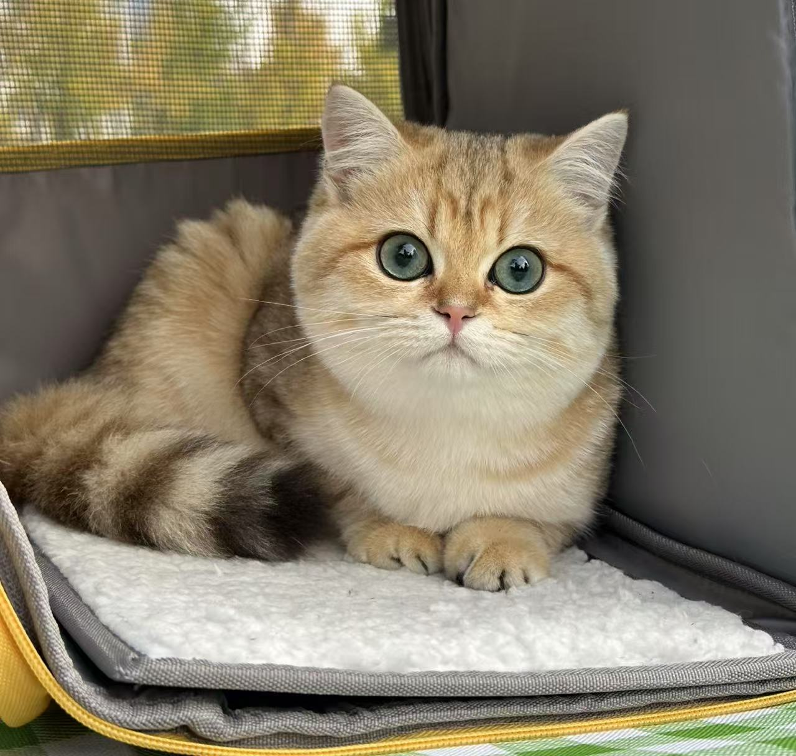








## About Me

I am **Qingni Wang**, a Master's student in Computer Science at the **University of Electronic Science and Technology of China (UESTC)**, supervised by [prof. Bo Fu](https://en.uestc.edu.cn/info/1074/2136.htm). Previously, I earned my Bachelor’s degree in Electronic Information Science and Technology from **China University of Mining and Technology (CUMT)** (2019.09 - 2023.06). I also visited the **Southern University of Science and Technology (SUSTECH)** (2024.06 - 2024.10), where I was supervised by [prof. Feng Zheng](https://scholar.google.com/citations?user=PcmyXHMAAAAJ&hl=en). I am currently a summer intern at the **University of California, Santa Barbara (UCSB)**(2025.06 - present), under the guidance of [prof. Xin Wang](https://eric-xw.github.io). My research interests include:
- **Uncertainty Quantification:** Conformal Prediction, Conformal Risk Control.
- **Hallucination in Question Answering (QA) Tasks of Multimodal Large Language Models (MLLMs).**
- **Trustworthy AI Agents: Risk-Aware Planning and Reliable Task Execution.**

You can find my CV here: [Qingni's Curriculum Vitae](../assets/wqn_phd.pdf).

You can check out my publications and updates on my [Google Scholar profile](https://scholar.google.com/citations?user=awhNfL4AAAAJ). 

# 🔥 News
- *2025.05*: 🎉🎉 One paper has been accepted to **ACL 2025(Main)**！See you in Vienna🇦🇹！
- *2025.02*: 🎉🎉 One paper has been accepted to **CVPR 2025**.
- *2025.01*: 🎉🎉 One paper has been accepted to **ICLR 2025 Spotlight (5%)**！See you in Singapore🇸🇬！
- *2024.11*: 🎉🎉 One paper has been accepted to **EMNLP 2024 (Findings)**.

# 📝 Publications

### Conference Papers:
† means equal contribution
1. **Qingni Wang**, Tiantian Geng, Zhiyuan Wang, Teng Wang, Bo Fu*, Feng Zheng*. "Sample then Identify: A General Framework for Risk Control and Assessment in Multimodal Large Language Models." **ICLR 2025 (Spotlight).** [[Paper]](https://openreview.net/forum?id=9WYMDgxDac)
2. **Qingni Wang**, Yue Fan, Xin Eric Wang. "SAFER: Risk-Constrained Sample-then-Filter in Large Language Models." Under review.[[Paper]](https://arxiv.org/pdf/2510.10193)
4. Zhiyuan Wang†, **Qingni Wang†**, Yue Zhang, Tianlong Chen, Xiaofeng Zhu, Xiaoshuang Shi, Kaidi Xu. "SConU: Selective Conformal Uncertainty in Large Language Models." **ACL 2025(Main).** [[Paper]](https://arxiv.org/pdf/2504.14154)
5. Tiantian Geng, Jinrui Zhang, **Qingni Wang**, Teng Wang, Jinming Duan*, Feng Zheng*. "LongVALE: Vision-Audio-Language-Event Benchmark Towards Time-Aware Omni-Modal Perception of Long Videos." **CVPR 2025.**[[Paper]](https://arxiv.org/pdf/2411.19772)
6. Zhiyuan Wang, Jinhao Duan, Lu Cheng, Yue Zhang, **Qingni Wang**, Xiaoshuang Shi*, Kaidi Xu, Hengtao Shen, Xiaofeng Zhu. "ConU: Conformal Uncertainty in Large Language Models with Correctness Coverage Guarantees." **EMNLP 2024 (Findings).** [[Paper]](https://aclanthology.org/2024.findings-emnlp.404/)

# 🎖 Honors and Awards
- **Academic Seedling Award**, 2025
- **Outstanding Student Scholarship**, 2023, 2024
- **First Prize Scholarship**, 2020, 2021

# 📜 Academic Services
- Annual Meeting of the Association for Computational Linguistics (ACL)

# 📩 Contact
**Email:** qingni1031@gmail.com

# 🙋🏻‍♀️ More about me
- I have a very cute cat named Bingbing (饼饼)!!! 🐱 And in my free time, I enjoy swimming. 🏊‍♀️

  

